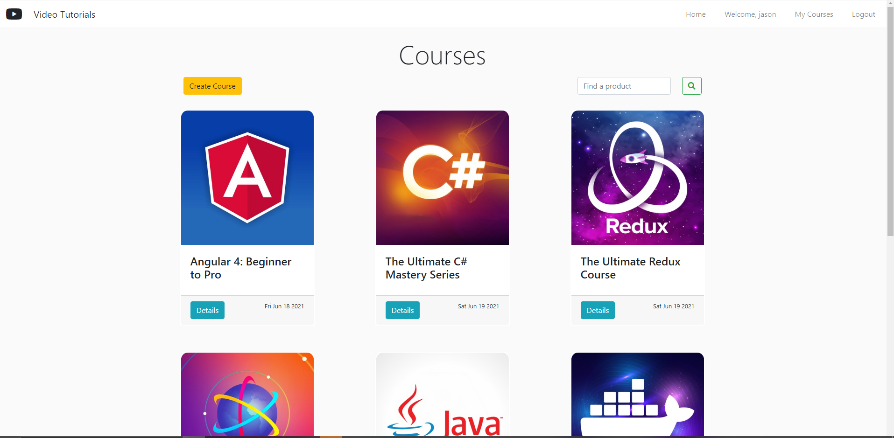

# Video Tutorial Single Page (CRUD) Application


<p align=”center”>

</p>

<!-- ABOUT THE PROJECT -->

## About The Project

Implemented a CRUD based Web application (SPA) that allows you to create and/or enroll in courses. If you are a guest user, then you are limited to view only access of the top 3 courses. User features include registration, login, logout, create, read, update and delete. All user authentication is handled by the database using Mongoose.

## What I learned 
Taking my JavaScript knowledge and supercharging it (see list below) was an exciting challange that I enjoyed. All of these new aspects gave me individual challanges that I was able to overcome with my resourcefulness. I most enjoyed Mongoose and would say that understanding all the idiosyncrasies of Express slowed me down a bit. Utilizing JSON WebToken with database validation was very informative although at this point I feel that server side validation should be default in order to maximize database performance. After learning Handlebars, I personally chose to learn another templating engine. EJS was definitely more versitile and made easier with the use of snippets. This was a good introductory project to new frameworks and libraries. My Bootstap and CSS knowledge is getting better with each project that I complete. I enjoyed building this CRUD application.


### Built With

- [Javascript](https://www.javascript.com/)
- [Express](https://expressjs.com/)
- [EJS](https://ejs.co/)
- [Bootstrap](https://getbootstrap.com/)
- [MongoDB](https://www.mongodb.com/)
- [Mongoose](https://mongoosejs.com/)
- [NodeJS](https://nodejs.dev/)
- [JSON WebToken](https://jwt.io/)

<!-- GETTING STARTED -->

## Getting Started

### Prerequisites

- npm
  ```sh
  npm install npm@latest -g
  ```

### Installation

1. Clone the repo
   ```sh
   git clone https://github.com/passandscore/Video-Tutorials.git
   ```
2. Install NPM packages
   ```sh
   npm install
   ```
3. Run Dev Server
   ```sh
   npm start
   ```

<!-- CONTRIBUTING -->

## Contributing

Contributions are what make the open source community such an amazing place to be learn, inspire, and create. Any contributions you make are **greatly appreciated**.

1. Fork the Project
2. Create your Feature Branch (`git checkout -b feature/AmazingFeature`)
3. Commit your Changes (`git commit -m 'Add some AmazingFeature'`)
4. Push to the Branch (`git push origin feature/AmazingFeature`)
5. Open a Pull Request


<!-- CONTACT -->

## Contact

Created by: [Jason Schwarz | LinkedIn](https://www.linkedin.com/in/jason-schwarz-75b91482/)

Project Link: [https://github.com/passandscore/Video-Tutorials](https://github.com/passandscore/Video-Tutorials)
